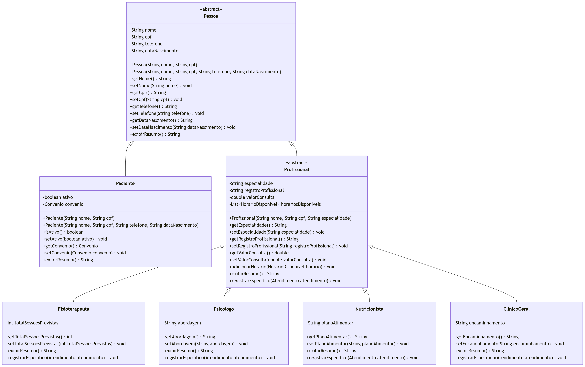
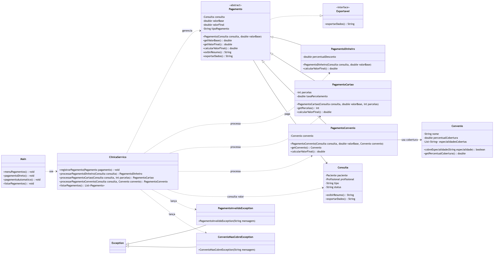
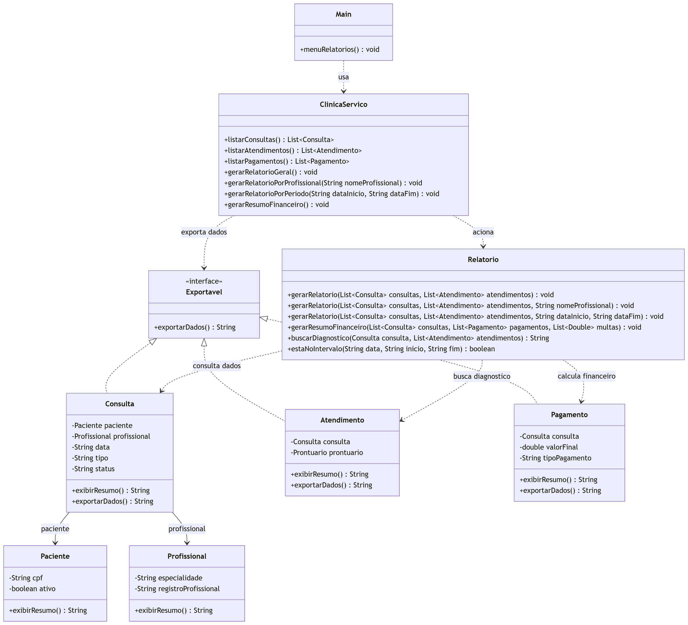

# Diagramas de Classes

Esta seção reúne os diagramas principais do sistema VidaPlena na etapa AV2. Os diagramas foram separados por área para facilitar a leitura dos relacionamentos e dos conceitos de Programação Orientada a Objetos aplicados no projeto.

Os códigos Mermaid ficam nos arquivos específicos de implementação, dentro de `docs/implementacao/`. Este arquivo funciona como um catálogo visual dos diagramas.

## Pacientes, Pessoa e Convênio

### Objetivo

Mostrar a estrutura da frente de pacientes, incluindo a herança entre `Pessoa` e `Paciente`, a associação com `Convenio` e as exceções ligadas a paciente e convênio.

### Classes envolvidas

- `Pessoa`
- `Paciente`
- `Convenio`
- `ClinicaServico`
- `Main`
- `PacienteNaoEncontradoException`
- `PacienteInativoException`
- `ConvenioNaoCobreException`

### Conceitos aplicados

- Herança
- Classe abstrata
- Encapsulamento
- Associação
- Coleções
- Exceções personalizadas
- Sobrescrita

### Diagrama

Código Mermaid: [docs/implementacao/pacientes.md](./implementacao/pacientes.md)

## Profissionais e Especialidades

### Objetivo

Mostrar a estrutura da frente de profissionais, incluindo a herança entre `Pessoa`, `Profissional` e as especialidades, além da agregação com `HorarioDisponivel`.

### Classes envolvidas

- `Pessoa`
- `Profissional`
- `Fisioterapeuta`
- `Psicologo`
- `Nutricionista`
- `ClinicoGeral`
- `HorarioDisponivel`
- `ClinicaServico`
- `Main`
- `ProfissionalNaoEncontradoException`

### Conceitos aplicados

- Herança
- Classe abstrata
- Encapsulamento
- Agregação
- Polimorfismo
- Sobrescrita
- Exceção personalizada

### Diagrama

Código Mermaid: [docs/implementacao/profissionais.md](./implementacao/profissionais.md)

## Consultas e Agendamento

### Objetivo

Mostrar a estrutura da frente de consultas, incluindo a classe `Consulta`, a interface `Agendavel`, os vínculos com paciente e profissional e as exceções usadas em conflitos de agenda.

### Classes envolvidas

- `Consulta`
- `Agendavel`
- `Paciente`
- `Profissional`
- `HorarioDisponivel`
- `ClinicaServico`
- `Main`
- `ConsultaNaoEncontradaException`
- `HorarioIndisponivelException`
- `PacienteInativoException`
- `OperacaoInvalidaException`

### Conceitos aplicados

- Interface
- Associação
- Agregação
- Encapsulamento
- Sobrecarga
- Controle de estado
- Exceções personalizadas

### Diagrama

Código Mermaid: [docs/implementacao/consultas.md](./implementacao/consultas.md)

## Atendimentos e Prontuário

### Objetivo

Mostrar a estrutura da frente de atendimentos, incluindo o registro clínico de uma consulta, a composição com `Prontuario` e a exportação textual por `Exportavel`.

### Classes envolvidas

- `Atendimento`
- `Prontuario`
- `Consulta`
- `Profissional`
- `Psicologo`
- `Exportavel`
- `ClinicaServico`
- `Main`
- `OperacaoInvalidaException`

### Conceitos aplicados

- Composição
- Associação
- Interface
- Sobrecarga
- Polimorfismo
- Sobrescrita
- Exceção personalizada

### Diagrama

Código Mermaid: [docs/implementacao/atendimentos.md](./implementacao/atendimentos.md)

## Pagamentos

### Objetivo

Mostrar a estrutura da frente de pagamentos, incluindo a classe base `Pagamento`, as formas especializadas de pagamento e o uso de `Convenio` no pagamento por convênio.

### Classes envolvidas

- `Pagamento`
- `PagamentoDinheiro`
- `PagamentoCartao`
- `PagamentoConvenio`
- `Consulta`
- `Convenio`
- `ClinicaServico`
- `Main`
- `PagamentoInvalidoException`
- `ConvenioNaoCobreException`

### Conceitos aplicados

- Herança
- Classe abstrata
- Polimorfismo
- Sobrescrita
- Sobrecarga
- Associação
- Exceções personalizadas

### Diagrama

Código Mermaid: [docs/implementacao/pagamentos.md](./implementacao/pagamentos.md)

## Relatórios e Exportação

### Objetivo

Mostrar a estrutura da frente de relatórios, incluindo a geração de relatórios gerenciais, resumo financeiro e exportação textual de dados operacionais.

### Classes envolvidas

- `Relatorio`
- `Exportavel`
- `Consulta`
- `Atendimento`
- `Pagamento`
- `Paciente`
- `Profissional`
- `ClinicaServico`
- `Main`

### Conceitos aplicados

- Interface
- Associação
- Sobrecarga
- Coleções
- Encapsulamento
- Reuso de lógica

### Diagrama

Código Mermaid: [docs/implementacao/relatorios.md](./implementacao/relatorios.md)

## Diagrama Planejado

O diagrama de `Serviço e Exceções` ainda pode ser criado depois para mostrar `ClinicaServico`, as coleções principais e o conjunto completo de exceções personalizadas do sistema.
