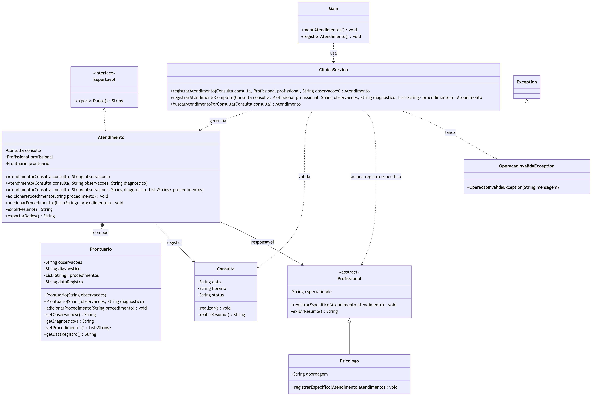
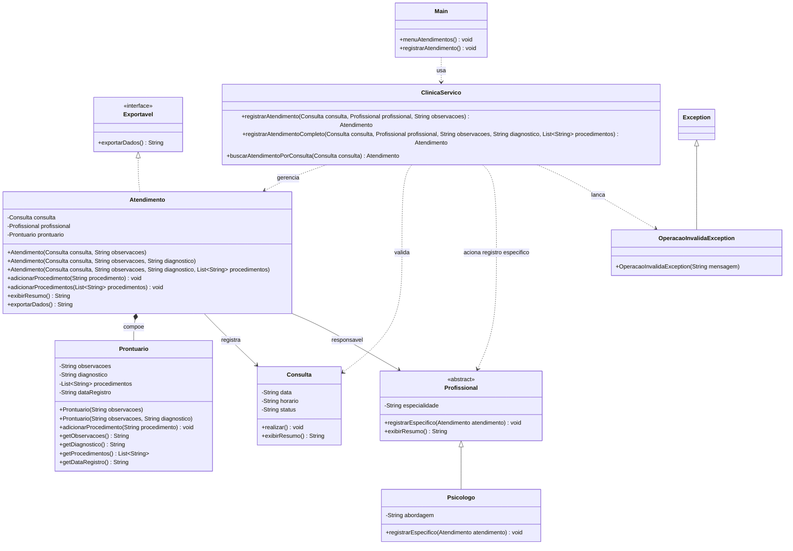

# Implementação - Atendimentos

## Objetivo

Documentar a parte de atendimentos da arquitetura final da AV2 do VidaPlena. Esta frente cobre o registro clínico de uma consulta realizada, incluindo observações, diagnóstico, procedimentos e prontuário.

O módulo representa o atendimento como o resultado clínico de uma consulta, conectando o registro do profissional ao histórico do paciente.

## Jornadas atendidas

- Jornada 8 - Registro de Atendimento.
- Jornada 24 - Registro de Atendimento com Prontuário.
- Jornada 25 - Registro Especializado de Atendimento Psicológico.

## Classes envolvidas

- `Atendimento`: representa o registro clínico feito após uma consulta.
- `Prontuario`: reúne observações, diagnóstico, procedimentos e data do registro.
- `Consulta`: fornece a consulta que deu origem ao atendimento.
- `Profissional`: participa do atendimento e pode registrar informações específicas da sua área.
- `Psicologo`: especialização de profissional usada no registro clínico especializado.
- `Exportavel`: interface para padronizar a exportação textual do atendimento.
- `OperacaoInvalidaException`: exceção para situações em que o atendimento não pode ser registrado.
- `ClinicaServico`: concentra as regras de registro e consulta dos atendimentos.
- `Main`: expõe as opções de acesso ao módulo de atendimentos.

## Conceitos aplicados

- Composição: `Atendimento` contém um `Prontuario`, que pertence ao registro clínico daquele atendimento.
- Associação: `Atendimento` se relaciona com `Consulta` e `Profissional`.
- Interface: `Exportavel` padroniza a saída textual do atendimento.
- Sobrecarga: o atendimento pode ser criado com observações, com diagnóstico ou com procedimentos completos.
- Polimorfismo: o profissional real pode executar um registro específico conforme sua especialidade.
- Sobrescrita: especializações de `Profissional` podem adaptar `registrarEspecifico(...)`.
- Exceção personalizada: `OperacaoInvalidaException` representa tentativas inválidas de registrar atendimento.

## Diagrama

Arquivo do diagrama: `docs/diagramas/atendimentos.png`.

O Mermaid abaixo é a fonte editável do diagrama.

## Código Mermaid

