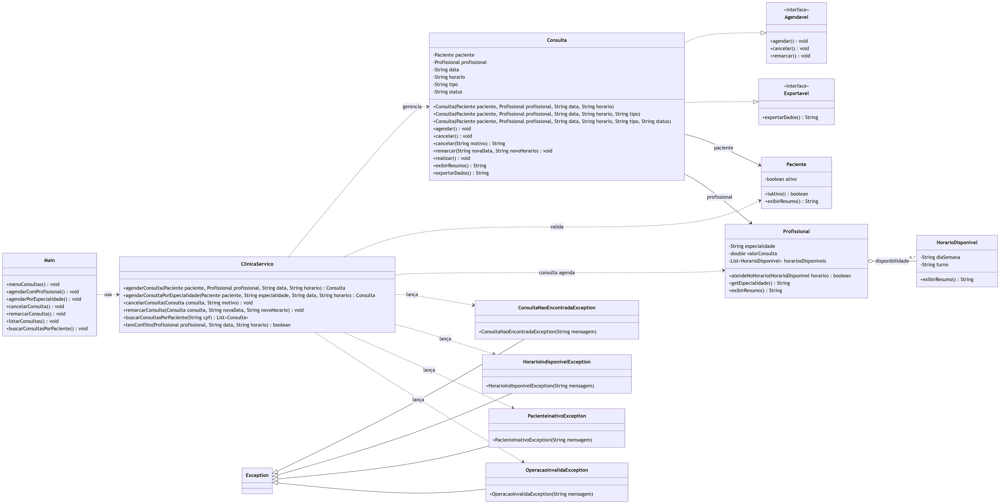
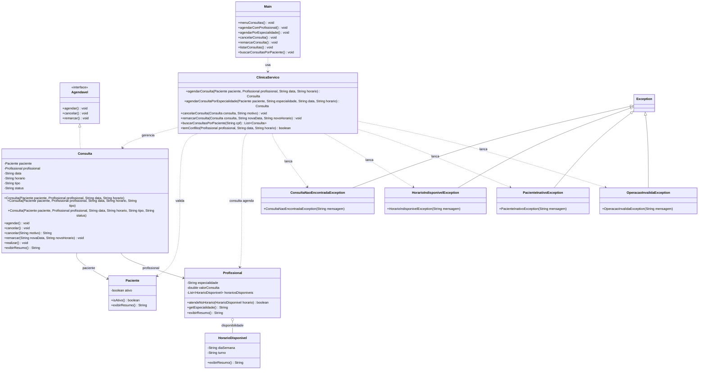

# Implementação - Consultas

## Objetivo

Documentar a parte de consultas e agendamento da arquitetura final da AV2 do VidaPlena. Esta frente cobre o vínculo entre paciente e profissional, o ciclo de vida da consulta, os conflitos de horário, o agendamento por especialidade, o cancelamento e a remarcação.

O módulo representa a consulta como o ponto central entre a disponibilidade do profissional e a situação cadastral do paciente.

## Jornadas atendidas

- Jornada 5 - Agendamento de Consulta por Profissional.
- Jornada 6 - Agendamento por Especialidade.
- Jornada 7 - Tratamento de Conflitos de Agenda.
- Jornada 9 - Cancelamento de Consulta.
- Jornada 10 - Remarcação de Consulta.
- Jornada 18 - Agendamento para Paciente Inativo.
- Jornada 19 - Tratamento de Conflitos de Horário.
- Jornada 30 - Tratamento Completo de Operações Inválidas.

## Classes envolvidas

- `Consulta`: representa o agendamento, com paciente, profissional, data, horário, tipo e status.
- `Agendavel`: interface que define operações básicas do ciclo de vida da consulta.
- `Paciente`: participa da consulta e precisa estar ativo para permitir agendamento.
- `Profissional`: participa da consulta e precisa ter disponibilidade no dia e horário solicitados.
- `HorarioDisponivel`: representa a disponibilidade usada para validar a agenda do profissional.
- `ConsultaNaoEncontradaException`: exceção para consultas inexistentes ou não localizadas.
- `HorarioIndisponivelException`: exceção para conflito de horário ou indisponibilidade do profissional.
- `PacienteInativoException`: exceção para impedir agendamento de paciente inativo.
- `OperacaoInvalidaException`: exceção para operações incompatíveis com o status da consulta.
- `ClinicaServico`: concentra as regras de agendamento, cancelamento, remarcação e busca.
- `Main`: expõe as opções de acesso ao módulo de consultas.

## Conceitos aplicados

- Interface: `Agendavel` padroniza as operações `agendar()`, `cancelar()` e `remarcar()`.
- Associação: `Consulta` se relaciona com `Paciente` e `Profissional`.
- Encapsulamento: dados da consulta ficam protegidos por métodos de acesso e operações próprias.
- Sobrecarga: a consulta pode ter construtores com tipo padrão, tipo informado ou status definido.
- Controle de estado: o atributo `status` representa consulta agendada, cancelada, remarcada ou realizada.
- Exceções personalizadas: regras inválidas de consulta, horário e paciente são tratadas por exceções próprias.
- Coleções: a busca por consultas e a verificação de conflitos percorrem a lista de consultas cadastradas.

## Diagrama

Arquivo do diagrama: `docs/diagramas/consultas-agendamento.png`.

O Mermaid abaixo é a fonte editável do diagrama.

## Código Mermaid

