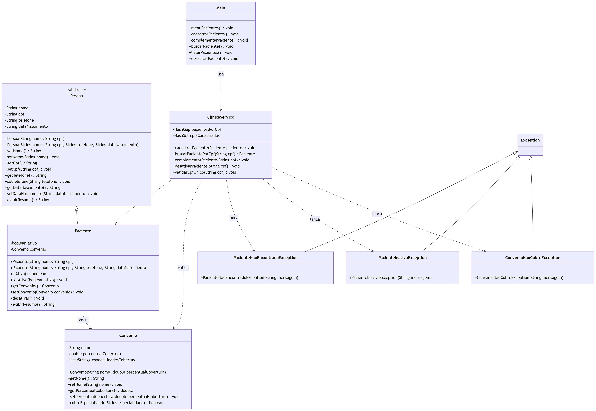
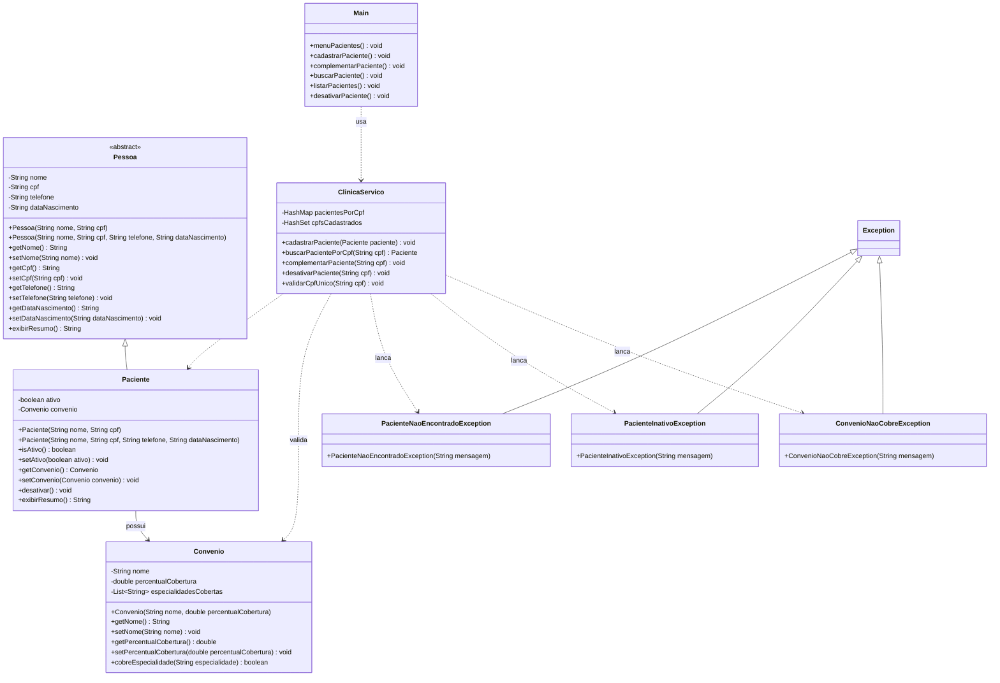

# Implementação - Pacientes

## Objetivo

Documentar a parte de pacientes da arquitetura final da AV2 do VidaPlena. Esta frente cobre a base de `Pessoa`, o cadastro de `Paciente`, a associação com `Convenio`, a validação de CPF e os tratamentos de erro ligados ao paciente.

## Jornadas atendidas

- Jornada 1 - Cadastro Simplificado de Paciente.
- Jornada 2 - Cadastro Completo de Paciente e Controle de Duplicidade.
- Jornada 3 - Complementação de Cadastro.
- Jornada 12 - Desativação de Paciente.
- Jornada 14 - Cadastro com Validação Robusta de Dados.
- Jornada 27 - Busca Instantânea de Pacientes.
- Jornada 28 - Controle de Unicidade de CPF.

## Classes envolvidas

- `Pessoa`: classe abstrata com dados comuns, como nome, CPF, telefone e data de nascimento.
- `Paciente`: especialização de `Pessoa`, com status ativo/inativo e convênio associado.
- `Convenio`: representa o convênio do paciente, percentual de cobertura e especialidades cobertas.
- `PacienteNaoEncontradoException`: exceção para busca de paciente inexistente.
- `PacienteInativoException`: exceção para impedir operações indevidas com paciente inativo.
- `ConvenioNaoCobreException`: exceção para situações em que o convênio não cobre determinada especialidade.
- `ClinicaServico`: concentra as regras de cadastro, busca, validação de CPF e desativação.
- `Main`: expõe as opções de acesso ao módulo de pacientes.

## Conceitos aplicados

- Herança: `Paciente` herda os dados comuns de `Pessoa`.
- Classe abstrata: `Pessoa` define a base comum e o método `exibirResumo()`.
- Encapsulamento: atributos privados com acesso por getters e setters.
- Associação: `Paciente` possui uma referência para `Convenio`.
- Coleções: `HashMap` para busca rápida por CPF e `HashSet` para impedir CPF duplicado.
- Exceções personalizadas: erros de paciente, paciente inativo e convênio sem cobertura.
- Sobrescrita: `Paciente` implementa seu próprio `exibirResumo()`.

## Diagrama

Arquivo do diagrama: `docs/diagramas/pacientes-pessoa-convenio.png`.

O PNG acima foi gerado a partir do Mermaid abaixo.

## Código Mermaid

