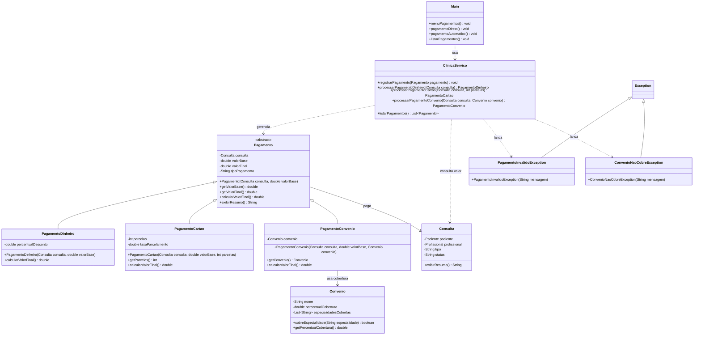

# Implementação - Pagamentos

## Objetivo

Documentar a parte de pagamentos da arquitetura final da AV2 do VidaPlena. Esta frente cobre o cálculo do valor final da consulta, as formas de pagamento, descontos, parcelamento, convênio e validações de pagamento.

O módulo representa o pagamento como uma estrutura polimórfica, permitindo que cada forma de pagamento aplique sua própria regra de cálculo.

## Jornadas atendidas

- Jornada 11 - Processamento de Pagamentos.
- Jornada 20 - Verificação de Cobertura de Convênio.
- Jornada 21 - Processamento de Pagamento em Dinheiro.
- Jornada 22 - Processamento de Pagamento em Cartão.
- Jornada 23 - Processamento de Pagamento por Convênio.

## Classes envolvidas

- `Pagamento`: classe base para registrar valor, consulta e cálculo do valor final.
- `PagamentoDinheiro`: especialização que representa pagamento em dinheiro.
- `PagamentoCartao`: especialização que representa pagamento parcelado no cartão.
- `PagamentoConvenio`: especialização que usa o convênio do paciente para aplicar cobertura.
- `Consulta`: fornece a consulta que está sendo paga.
- `Convenio`: define percentual de cobertura e especialidades cobertas.
- `PagamentoInvalidoException`: exceção para valor, parcela ou tipo de pagamento inválido.
- `ConvenioNaoCobreException`: exceção para situações em que o convênio não cobre a consulta.
- `ClinicaServico`: concentra as regras de registro e cálculo dos pagamentos.
- `Main`: expõe as opções de acesso ao módulo de pagamentos.

## Conceitos aplicados

- Herança: `PagamentoDinheiro`, `PagamentoCartao` e `PagamentoConvenio` herdam de `Pagamento`.
- Classe abstrata: `Pagamento` organiza atributos e comportamentos comuns das formas de pagamento.
- Polimorfismo: pagamentos diferentes podem ser tratados pela referência `Pagamento`.
- Sobrescrita: cada forma de pagamento pode redefinir `calcularValorFinal()`.
- Sobrecarga: métodos de cálculo podem considerar apenas valor base, desconto ou multa.
- Associação: `Pagamento` se relaciona com `Consulta`; `PagamentoConvenio` se relaciona com `Convenio`.
- Exceções personalizadas: pagamentos inválidos e convênios sem cobertura são tratados por exceções próprias.

## Diagrama

Arquivo do diagrama: `docs/diagramas/pagamentos.png`.

O Mermaid abaixo é a fonte editável do diagrama.

## Código Mermaid

