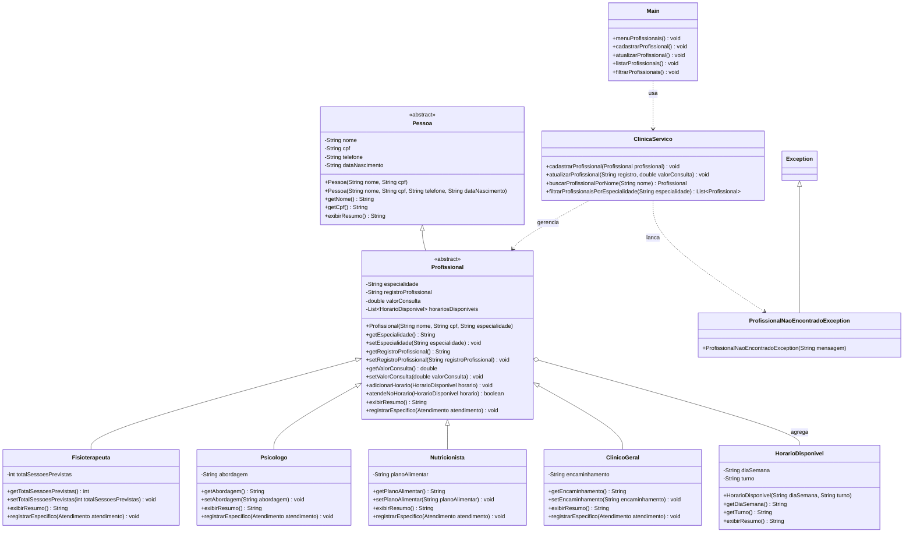

# Implementação - Profissionais

## Objetivo

Documentar a parte de profissionais da arquitetura final da AV2 do VidaPlena. Esta frente cobre o cadastro de profissionais, a hierarquia de especialidades, os horários disponíveis e a localização de profissionais pelo sistema.

O módulo representa os profissionais da clínica como uma base comum, com especializações para cada área de atendimento.

## Jornadas atendidas

- Jornada 4 - Cadastro e Atualização de Profissionais.
- Jornada 16 - Cadastro de Fisioterapeuta.
- Jornada 17 - Cadastro de Psicólogo.
- Jornada 29 - Gestão de Horários Disponíveis.

## Classes envolvidas

- `Pessoa`: classe abstrata com dados comuns reaproveitados por profissionais.
- `Profissional`: classe base dos profissionais da clínica, com especialidade, registro, valor de consulta e horários.
- `Fisioterapeuta`: especialização de `Profissional` voltada para atendimentos de fisioterapia.
- `Psicologo`: especialização de `Profissional` voltada para atendimentos psicológicos.
- `Nutricionista`: especialização de `Profissional` voltada para atendimentos de nutrição.
- `ClinicoGeral`: especialização de `Profissional` voltada para atendimento clínico geral.
- `HorarioDisponivel`: representa dias e turnos em que o profissional pode atender.
- `ProfissionalNaoEncontradoException`: exceção para busca de profissional inexistente.
- `ClinicaServico`: concentra as regras de cadastro, atualização, filtro por especialidade e horários.
- `Main`: expõe as opções de acesso ao módulo de profissionais.

## Conceitos aplicados

- Herança: `Profissional` herda de `Pessoa`, e as especialidades herdam de `Profissional`.
- Classe abstrata: `Pessoa` e `Profissional` organizam atributos e comportamentos comuns.
- Encapsulamento: dados como registro, valor de consulta e horários ficam protegidos por métodos.
- Agregação: `Profissional` mantém uma lista de `HorarioDisponivel`, mas o horário pode existir como informação independente.
- Sobrescrita: cada especialidade pode adaptar `exibirResumo()` e `registrarEspecifico()`.
- Polimorfismo: listas de `Profissional` podem armazenar fisioterapeutas, psicólogos, nutricionistas e clínicos gerais.
- Exceção personalizada: `ProfissionalNaoEncontradoException` representa falhas na busca de profissionais.

## Diagrama

Arquivo do diagrama: `docs/diagramas/profissionais-especialidades.png`.

O PNG acima foi gerado a partir do Mermaid abaixo.

## Código Mermaid

