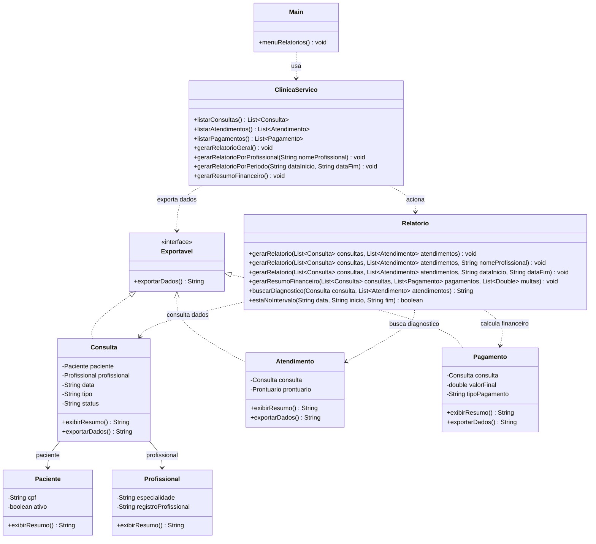

# Implementação - Relatórios

## Objetivo

Documentar a parte de relatórios e exportação da arquitetura final da AV2 do VidaPlena. Esta frente cobre a emissão de relatórios gerenciais, filtros por profissional e período, resumo financeiro e padronização de saídas textuais.

O módulo reúne dados de consultas, atendimentos e pagamentos para apresentar uma visão consolidada da operação da clínica.

## Jornadas atendidas

- Jornada 13 - Emissão de Relatórios Gerenciais.
- Jornada 15 - Relatório Unificado de Cadastros.
- Jornada 26 - Exportação de Dados Operacionais.

## Classes envolvidas

- `Relatorio`: concentra a geração dos relatórios gerais, filtrados e financeiros.
- `Exportavel`: interface para padronizar saídas textuais de dados operacionais.
- `Consulta`: fornece dados de agendamento, profissional, paciente, data e status.
- `Atendimento`: fornece observações, diagnóstico e procedimentos registrados.
- `Pagamento`: fornece valor final, tipo de pagamento e parcelas.
- `Paciente`: participa dos dados cadastrais usados nos relatórios unificados.
- `Profissional`: participa dos filtros e agrupamentos por profissional ou especialidade.
- `ClinicaServico`: concentra o acesso às listas de dados usadas pelos relatórios.
- `Main`: expõe as opções de acesso ao módulo de relatórios.

## Conceitos aplicados

- Interface: `Exportavel` padroniza a exportação textual de dados operacionais.
- Associação: `Relatorio` usa dados de consultas, atendimentos, pagamentos, pacientes e profissionais.
- Sobrecarga: `gerarRelatorio(...)` possui variações para relatório geral, por profissional e por período.
- Coleções: listas de consultas, atendimentos e pagamentos são percorridas para montar os resultados.
- Encapsulamento: os dados usados nos relatórios são acessados por métodos das classes do domínio.
- Reuso de lógica: métodos auxiliares como busca de diagnóstico e filtro por período evitam repetição.

## Diagrama

Arquivo do diagrama: `docs/diagramas/relatorios.png`.

O Mermaid abaixo é a fonte editável do diagrama.

## Código Mermaid

